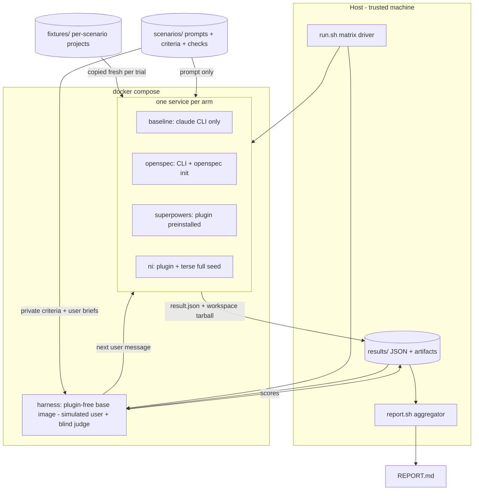

# benchmark — Design Doc

## Context

Three spec/workflow plugins for Claude Code solve the same problem differently: [OpenSpec](https://github.com/Fission-AI/OpenSpec) (npm CLI, `/opsx:*` commands), [superpowers](https://github.com/obra/superpowers) (marketplace plugin, skill library), and [ni](https://github.com/itsaspacestation/natural-intelligence) (marketplace plugin, terse mode, plan/debug skills). No neutral comparison exists: the only published numbers are self-reported by the superpowers author ([Superpowers 6 post](https://blog.fsck.com/2026/06/15/Superpowers-6/)) or third-party with different goals.

This project builds a benchmark adapted from the superpowers eval lab ([prime-radiant-inc/superpowers-evals](https://github.com/prime-radiant-inc/superpowers-evals), "Quorum") methodology: isolated per-run environments, identical scenarios per arm, LLM judging against withheld acceptance criteria plus deterministic checks, and a comparison report with one KPI table per scenario.

## Functional Requirements

### FR1 — Isolated arms via docker compose
One docker compose service per arm: `baseline` (no plugin), `openspec`, `superpowers`, `ni` — plus a fifth plugin-free `harness` service running the simulated user and the judge ([FR8](#fr8), [FR5](#fr5)). Each arm image contains a pinned Claude Code CLI and its plugin preinstalled at build time. Each trial runs with a throwaway `$HOME` created per run (superpowers-evals pattern), so no host `~/.claude` config, plugins, or session state leaks in. The baseline arm anchors normalisation: plugin effect is measured against it. Credential: `.env` (gitignored) loaded via compose `env_file`, holding `ANTHROPIC_API_KEY` or `CLAUDE_CODE_OAUTH_TOKEN` (`claude setup-token`); never baked into images.

### FR2 — Scenario suite, easy to complex
Seven scenarios — five home-grown across two skill families plus one build task, and two adapted from superpowers-evals as an external anchor — identical prompt text for every arm:

| ID | Family | Difficulty | Origin | Summary |
|---|---|---|---|---|
| `plan-easy` | plan | easy | home-grown | Plan adding a `--json` output flag to a small CLI fixture |
| `plan-complex` | plan | complex | home-grown | Plan a rate-limited API client with persistence, retry, and versioned public contract |
| `debug-easy` | debug | easy | home-grown | Fixture with one failing test, planted single-line bug |
| `debug-complex` | debug | complex | home-grown | Symptom report only, no failing test; planted cross-module off-by-one |
| `build-small` | build | medium | home-grown | Implement a small feature test-first in the fixture, tests must pass |
| `ported-debug` | debug | medium | superpowers-evals | Conversation-style debugging under user pressure for a quick fix |
| `ported-build` | build | complex | superpowers-evals | Scaled-down `sdd-*` end-to-end build with hidden planted-defect checks |

Each scenario ships: prompt file, fixture project (with green test baseline), private acceptance criteria (withheld from the subject agent), and deterministic post-checks. Ported scenarios carry their origin tag into the report; adaptation and licence rules in the [scenario-matrix ADR](../adrs/scenario-matrix.md).

### FR3 — Per-plugin verbosity policy
ni arm: terse `full`, seeded by writing `full` to `$HOME/.claude/ni/terse` in the throwaway home before launch. OpenSpec and superpowers: no verbosity option exists (verified — see [verbosity-policy ADR](../adrs/verbosity-policy.md)), so they run at their defaults. Baseline: default Claude Code style.

### FR4 — KPI capture
Each trial runs `claude -p "<scenario prompt>" --output-format json --dangerously-skip-permissions` inside the arm container, plus any [FR8](#fr8) resume turns. Captured per trial, summed across all subject turns: `total_cost_usd`, input/output token usage, `duration_ms`, `num_turns` from the CLI JSON results, plus `user_turns` and artifact metrics computed from produced files: plan word count (per-arm artifact glob), files created, tests passing after run. Simulator usage is recorded separately and never enters subject KPIs.

### FR5 — Blind LLM judge plus deterministic checks
A judge script scores each trial against the scenario's private acceptance criteria on a 0–100 rubric (plan quality: completeness, testability, traceability, task actionability; verbosity: signal density; debug: root cause named before fix). Judge input is stripped of plugin names and arm identifiers. Deterministic post-checks (test suite exit code, expected file exists) run independently of the judge. Verdict per trial: `pass` / `fail` / `indeterminate` (superpowers-evals three-valued model).

### FR6 — Comparison report
The report generator (`harness` Python package, invoked via `./scripts/report.sh`) aggregates `results/**/result.json` into the generated REPORT.md: one table per scenario, rows = KPI names, columns = arms, each cell = `score% (raw)` — e.g. `78% (41 230 tok)`, `62% (1 480 words)`. Plus a run-metadata header (models, CLI version, plugin versions, n, date).

### FR7 — Repeatable trials
`n` trials per arm×scenario, configurable (default 1 for smoke, 3 for the reported matrix). Aggregation uses median for raw KPIs, pass-rate for outcomes. Indeterminate trials are excluded from medians and reported separately.

### FR8 — Simulated user for multi-turn interaction
Plugins under test are interactive (plan-mode approval, clarifying questions, ADR ratification). A simulated user in a dedicated plugin-free `harness` compose service (fixed cheap model, per-scenario user brief identical across arms) answers the subject's questions and approval gates; the subject resumes via `claude -p --resume`, capped at 6 user turns. Simulator answers come only from the brief; unanswerable questions get "your call, decide and continue". Simulator spend counts toward the cost cap but not toward subject KPIs; `user_turns` becomes a KPI. See [simulated-user ADR](../adrs/simulated-user.md).

### FR9 — Analysis and recommendations
The generated REPORT.md stays pure numbers ([NFR3](#nfr3)). A companion ANALYSIS.md, written once after the matrix (orchestrator work, reviewed by the human), delivers the interpretation:
- **Bias table**: per scenario, the expected structural bias direction (home-grown plan/debug scenarios are shaped like ni's skill families; ported scenarios like superpowers') and whether results follow or defy it — winning against the grain is the stronger signal.
- **True-enhancement reading**: per arm, where it beats `baseline` on outcome and quality, not only on style KPIs; token/cost deltas framed against the quality gained.
- **Recommendations**: per plugin, when to use it, observed weaknesses, configuration advice (e.g. whether ni terse `full` cost quality anywhere); per benchmark, what to improve next run.
- **Disclosure**: verbosity-configuration asymmetry ([FR3](#fr3)), benchmark-author affiliation (ni's author runs this benchmark), judge/blinding residual risks.
The bias reasoning follows the ni `bias-analysis` method (sponsor bias, selection bias, survivorship) applied to our own setup.

## Non-Functional Requirements

### NFR1 — Isolation verified
- **Scenario**: any compose service started → no host Claude config reachable
- **Measure**: compose file mounts no path under host `~/.claude` or `~/.config`; inside each container `ls ~/.claude/plugins` shows only the arm's own plugin (nothing for `baseline` and `harness`)
- **Verify**: `./scripts/check-isolation.sh` — greps compose config for forbidden mounts and runs the in-container listing; exits 0 when clean

### NFR2 — Cost cap
- **Scenario**: full matrix (4 arms × 7 scenarios × n trials) → bounded spend
- **Measure**: sum of `total_cost_usd` (subject + judge + simulated user) ≤ 50 × n USD (50 USD at n=1, 150 USD at the reported n=3); `cost_guard` stops the matrix at the cap
- **Verify**: `./scripts/cost-check.sh` — compares `jq -s '[.[].total_cost_usd] | add' results/**/result.json` against 50 × n (per-trial `total_cost_usd` already sums subject, judge, and simulator)

### NFR3 — Deterministic report
- **Scenario**: `report` re-run on unchanged `results/` → identical output
- **Measure**: byte-identical REPORT.md output
- **Verify**: `./scripts/report.sh && cp REPORT.md /tmp/r1 && ./scripts/report.sh && diff /tmp/r1 REPORT.md`

### NFR4 — Judge blinding
- **Scenario**: judge prompt assembled for any trial → no arm identifier present
- **Measure**: zero matches for `ni|openspec|opsx|superpowers|baseline|natural-intelligence|fission|obra|itsaspacestation|terse` (case-insensitive, word-bounded) in judge input
- **Verify**: `./scripts/check-blinding.sh` over the saved judge inputs; exits 0 when clean

## Non-goals

- Benchmarking other coding agents (Codex, Gemini CLI…): all arms run Claude Code only. Cross-agent comparison is what everyharness-container does; out of scope for cost reasons.
- SWE-bench-style large task sets: seven scenarios, not hundreds. Statistical power is limited by budget; report states n.
- Number-for-number comparison with published superpowers-evals results: different harness, judge, and models — the two ported scenarios anchor behaviour, not published figures.
- Judging plugin ergonomics for humans (install UX, docs quality): only agent-run outcomes are scored.
- CI integration: runs are launched manually from a trusted machine because arms run with `--dangerously-skip-permissions` (superpowers-evals has the same constraint).

## Rabbit holes

- **Plugin install inside image build**: marketplace installs need network and a writable `$HOME` at build time. Cap: if `claude plugin install` resists non-interactive build, fall back to COPYing a cloned plugin repo into the image's plugin cache path; time-box 60 min.
- **Judge rubric tuning**: endless prompt iteration possible. Cap: one calibration pass on the smoke run, then freeze the rubric for the reported matrix.
- **KPI normalisation debates**: settled once in the [kpi-scoring ADR](../adrs/kpi-scoring.md); the report never invents a new formula.
- **OpenSpec non-plugin nature**: it is an npm CLI, not a marketplace plugin. Do not try to wrap it as a plugin; install the CLI and run `openspec init` on the fixture, use its `/opsx:*` commands. Cap: if `/opsx:` commands fail headless, invoke the generated command markdown content directly as the prompt prefix; time-box 45 min.

## Failure modes

| Failure | Detection | Response | Blast radius |
|---|---|---|---|
| API rate limit / 5xx during trial | non-zero `claude -p` exit or error JSON | retry once; then verdict `indeterminate` | single trial |
| Trial exceeds time-box | trial wall-clock (all subject turns combined) > 20 min | kill container, verdict `indeterminate` | single trial |
| Plugin install fails at image build | docker build non-zero exit | build fails fast; fix Dockerfile before any run | whole arm, pre-run |
| Judge output unparseable | JSON parse error on judge reply | retry once with format reminder; then `indeterminate` | single trial |
| Simulated-user loop exceeds 6 user turns | turn counter | stop resuming, grade trial as-is; `user_turns` KPI records the cap | single trial |
| Simulator answers outside its brief | post-hoc grep of simulator replies against brief facts during calibration | fix brief/rules at smoke calibration, frozen after | scenario |
| Fixture tests red before run | pre-check in runner | abort trial, fix fixture; never grade on a broken baseline | scenario |
| Cost overrun mid-matrix | running sum > cap after each trial | stop matrix, report partial results marked partial | remaining trials |

## Design

Trust boundary: the arm containers run untrusted-quality model output with `--dangerously-skip-permissions` — they get no host mounts except the per-trial fixture copy and write only to their result volume; the API credential (`ANTHROPIC_API_KEY` or `CLAUDE_CODE_OAUTH_TOKEN`) is the single secret passed (env, from the gitignored `.env`). STRIDE consequence: never mount the repo root or host `$HOME` into an arm; results volume is per-trial and read back by the host, never executed.

Flow per trial: `run.sh` picks (arm, scenario, trial-id) → creates fresh trial dir (fixture copy + throwaway HOME) → `docker compose run <arm>` executes `claude -p` with the scenario prompt → while the final message asks a question or awaits approval (cap 6), the simulated user (`harness` service, [FR8](#fr8)) generates the next message and the subject resumes via `claude -p --resume` → runner saves CLI JSON, produced files, git diff of fixture → post-checks run in-container (test suite) → judge (`harness` service) scores blinded transcript+artifacts → `result.json` written → `report.sh` renders REPORT.md.

Decisions:
- [Isolation: docker compose with throwaway HOME](../adrs/isolation-docker-compose.md)
- [Blind LLM judge plus deterministic checks](../adrs/blind-llm-judge.md)
- [Scenario matrix](../adrs/scenario-matrix.md)
- [KPI set and scoring normalisation](../adrs/kpi-scoring.md)
- [Per-plugin verbosity policy](../adrs/verbosity-policy.md)
- [Simulated user for multi-turn interaction](../adrs/simulated-user.md)

## Data & migration

N/A: no persistence beyond flat `results/` JSON files and the generated REPORT.md; both are regenerable.

## Cross-cutting Concerns

- Observability: every trial dir keeps the full `claude -p` JSON per turn, the simulator transcript, the judge input/output, and the fixture diff — enough to re-triage any verdict without re-running.
- Rollout: smoke run (`plan-easy`, all arms, n=1) gates the full matrix.
- Rollback: N/A — read-only comparison, no production surface.
