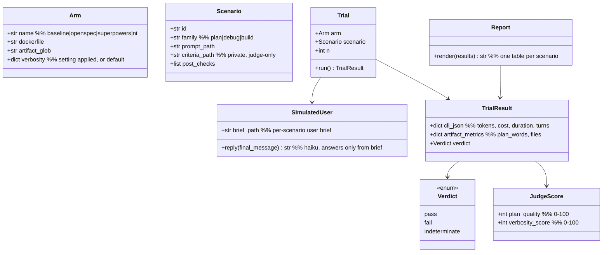

# benchmark — Tasks

Design: [DESIGN.md](./DESIGN.md)

## Analysis

The repo is empty (LICENSE + initial commit); the harness defines its own commands, created in task 1 and verified at the session 1 checkpoint:

Build: `docker compose build` — to be created (task 1/2)
Test: `uv run pytest` (harness unit tests) — to be created (task 1)
Lint: `uv run ruff check harness/` — to be created (task 1)

Host prerequisites verified: claude CLI 2.1.285, Docker 29.4.3, Compose v5.1.3. Credential: `.env` at repo root (gitignored) holding either `ANTHROPIC_API_KEY` (Console API key) or `CLAUDE_CODE_OAUTH_TOKEN` (subscription: generated once on the host with `claude setup-token`). Compose loads it via `env_file` and passes the variable through to arm containers; the Dockerfiles never contain the credential, so it is absent from images and layers.

### Known-failing tests
| Test | Reason | Action |
|---|---|---|
| `fixtures/debug-easy` test suite | intentionally red — planted bug is the scenario | runner treats red-on-arrival as expected for this scenario only |

### Domain model

### Requirement traceability

| Type / Fn | Stability | Addresses | Notes |
|---|---|---|---|
| `Arm` | internal | [FR1](./DESIGN.md#fr1), [FR3](./DESIGN.md#fr3) | compose service + config record |
| `Scenario` | internal | [FR2](./DESIGN.md#fr2) | prompt public, criteria private |
| `Trial` / `run_trial` | internal | [FR4](./DESIGN.md#fr4), [FR7](./DESIGN.md#fr7) | one container run |
| `TrialResult` | internal | [FR4](./DESIGN.md#fr4) | `result.json` schema |
| `Verdict` | internal | [FR5](./DESIGN.md#fr5) | three-valued |
| `SimulatedUser` / `reply` | internal | [FR8](./DESIGN.md#fr8) | `harness` compose service, haiku, brief-bounded |
| `JudgeScore` / `judge_trial` | internal | [FR5](./DESIGN.md#fr5), [NFR4](./DESIGN.md#nfr4) | blinded input |
| `score_kpi` | internal | [FR6](./DESIGN.md#fr6) | formulas from [kpi-scoring ADR](./adrs/kpi-scoring.md) |
| `Report.render` | internal | [FR6](./DESIGN.md#fr6), [NFR3](./DESIGN.md#nfr3) | pure function of results |
| REPORT.md format | published | [FR6](./DESIGN.md#fr6) | the deliverable readers consume; format changes additive only |

### Transformations

| Function | Input → Output | Invariant / Rule |
|---|---|---|
| `run_trial` | `(Arm, Scenario, n) → TrialResult` | fresh HOME + fixture copy per call; no host config reachable ([NFR1](./DESIGN.md#nfr1)) |
| `run_trial` (CLI error) | `→ TrialResult(verdict=indeterminate)` | one retry then indeterminate — from failure modes |
| `run_trial` (timeout > 20 min) | `→ TrialResult(verdict=indeterminate)` | container killed — from failure modes |
| `SimulatedUser.reply` | `final assistant message → user message` | facts only from brief; brief-silent → "your call, decide and continue"; never adds requirements ([FR8](./DESIGN.md#fr8)) |
| `run_trial` (7th question) | `→ stop resuming, grade as-is` | 6-user-turn cap — from failure modes |
| `blind` | `transcript+artifacts → judge input` | zero arm-identifier matches ([NFR4](./DESIGN.md#nfr4)) |
| `judge_trial` (bad JSON) | `→ retry once → indeterminate` | from failure modes |
| `score_kpi` | `raw values → percent` | exact formulas in [kpi-scoring ADR](./adrs/kpi-scoring.md); `plan_words` scored only where `plan_quality ≥ 50` |
| `aggregate` | `n TrialResults → row` | median for raw/judge, pass-rate for outcome; indeterminate excluded, footnoted |
| `Report.render` | `results/ → REPORT.md` | deterministic: same input, byte-identical output ([NFR3](./DESIGN.md#nfr3)) |
| `cost_guard` | `running sum → continue/stop` | stop when sum > 50 × n USD ([NFR2](./DESIGN.md#nfr2)), partial report marked partial |

## Tasks

### 1. Harness scaffold ([FR1](./DESIGN.md#fr1))
**Goal**: Repo layout, Python harness package, base image with pinned Claude CLI, compose skeleton.
**Types**: `Arm`, `TrialResult` (schema only)
**Constraints**:
- [ADR: isolation-docker-compose](./adrs/isolation-docker-compose.md) — common base image, per-arm Dockerfiles derive from it
- Layout: `harness/` (Python, uv), `arms/` (Dockerfiles), `fixtures/`, `scenarios/`, `scripts/`, `results/` (gitignored), `.env` (gitignored)
- Credential path: compose `env_file: .env`, passthrough of `ANTHROPIC_API_KEY` / `CLAUDE_CODE_OAUTH_TOKEN` only; no credential ARG/ENV in any Dockerfile; `.env.example` committed with empty keys
**Tests**: `test_result_schema_roundtrip` — TrialResult serialises/deserialises losslessly; `test_arm_registry_lists_four_arms`
**Verify**: `uv run pytest && uv run ruff check harness/ && docker compose config -q`
**Acceptance criteria**:
- [x] `docker build` of base image succeeds with pinned `@anthropic-ai/claude-code` version
- [x] `uv run pytest` green; `.gitignore` covers `results/`, `.env`
**Depends on**: (none)
**Time-box**: ~60 min

### 2. Arm images and isolation check ([FR1](./DESIGN.md#fr1), [FR3](./DESIGN.md#fr3), [NFR1](./DESIGN.md#nfr1))
**Goal**: Four runnable arm services with plugins baked in and verbosity policy applied, plus the plugin-free `harness` service (base image reused) for simulator and judge.
**Types**: `Arm`
**Constraints**:
- [ADR: isolation-docker-compose](./adrs/isolation-docker-compose.md) — build-time plugin install; documented COPY fallback if non-interactive install fails (60 min rabbit-hole cap)
- [ADR: verbosity-policy](./adrs/verbosity-policy.md) — ni: `full` written to `$HOME/.claude/ni/terse` at container start; openspec: `OPENSPEC_TELEMETRY=0`; others untouched
- No compose mount from host `~/.claude` or `~/.config`
**Tests**: `test_compose_has_no_host_config_mounts` (parses `docker compose config` JSON); in-container smoke per arm: `claude --version` and plugin presence listing
**Verify**: `./scripts/check-isolation.sh`
**Acceptance criteria**:
- [x] Each arm container lists exactly its own plugin (baseline and `harness`: none)
- [x] ni arm session shows terse `full` banner in a probe run — proven offline via state file (`$HOME/.claude/ni/terse` = `full` in a tmpfs throwaway HOME) plus SessionStart hook scripts present; the literal banner needs credentials, re-checked in the task 7 smoke run
**Depends on**: task 1
**Time-box**: ~90 min

### 3. Fixtures and scenarios ([FR2](./DESIGN.md#fr2))
**Goal**: Seven fixture projects plus prompt, private criteria, and post-checks per scenario — five home-grown, two adapted from superpowers-evals.
**Types**: `Scenario`
**Constraints**:
- [ADR: scenario-matrix](./adrs/scenario-matrix.md) — structural difficulty encoding; hidden tests for `debug-complex`, `build-small`, `ported-build`; pytest fixtures, green baseline except `debug-easy`; ported scenarios follow the ADR adaptation rules and carry `origin: superpowers-evals`
- superpowers-evals licence verified before content reuse; incompatible → re-author from published descriptions (behavioural shape only)
- Criteria files never enter the arm container (runner mounts prompt only)
- Per-scenario user brief for the simulated user ([FR8](./DESIGN.md#fr8), [ADR: simulated-user](./adrs/simulated-user.md)): facts, preferences, approval rule; identical text for all arms; brief never enters the arm container either
**Tests**: `test_fixture_baselines` — each fixture suite green (debug-easy expected red on the planted test only); `test_scenario_files_complete` — every scenario has prompt, criteria, post-check
**Verify**: `uv run pytest harness/tests/test_scenarios.py`
**Acceptance criteria**:
- [x] 7 scenario dirs complete; hidden tests absent from fixture dirs shipped to arms (`scenario_arm_files` shipping rule + test)
- [x] `debug-complex` symptom-masking fix demonstrably fails the hidden post-check (proven by `scenarios/debug-complex/hidden/wrong_fix.patch`: visible suite green, hidden tests red — regression-tested)
- [x] Ported scenarios: licence check recorded (no licence in superpowers-evals → re-authored from behavioural shape, see `scenarios/ported-*/ORIGIN.md`); prompts pass the neutral-vocabulary rule from the ADR
**Depends on**: task 1
**Time-box**: ~2 × 90 min (split home-grown / ported if it overruns)

### 4. Trial runner with simulated-user loop ([FR4](./DESIGN.md#fr4), [FR7](./DESIGN.md#fr7), [FR8](./DESIGN.md#fr8), [NFR2](./DESIGN.md#nfr2))
**Goal**: Execute (arm, scenario, n) trials as a resume loop with the simulated user; capture CLI JSON per turn, artifacts, diffs; enforce cost guard and timeout.
**Types**: `Trial`, `TrialResult`, `SimulatedUser`
**Constraints**:
- Transformations: `run_trial` and `SimulatedUser.reply` invariants above (fresh HOME, retry-once, 20 min timeout, 6-user-turn cap, indeterminate paths)
- [ADR: simulated-user](./adrs/simulated-user.md) — simulator in the `harness` service with `claude-haiku-4-5-20251001`, brief-bounded replies, subject resumed via `claude -p --resume <session-id>`; simulator tokens accounted separately from subject KPIs
- `cost_guard` stops the matrix over 50 × n USD
- Runner never interprets results — capture only
**Tests**: `test_trial_dir_layout`, `test_retry_then_indeterminate` (mocked CLI failure), `test_timeout_kills_and_marks_indeterminate` (mocked), `test_cost_guard_stops_matrix`, `test_resume_loop_stops_at_turn_cap` (mocked simulator), `test_simulator_tokens_excluded_from_subject_kpis`
**Verify**: `uv run pytest harness/tests/test_runner.py`
**Acceptance criteria**:
- [x] `result.json` contains tokens, cost, duration, turns, `user_turns`, artifact metrics for a mocked run
- [x] No network or API needed for runner unit tests (CLI and simulator mocked)
**Depends on**: tasks 2, 3
**Time-box**: ~90 min

### 5. Blind judge ([FR5](./DESIGN.md#fr5), [NFR4](./DESIGN.md#nfr4))
**Goal**: Blinding transform, rubric prompt, deterministic post-check integration, three-valued verdict.
**Types**: `JudgeScore`, `Verdict`
**Constraints**:
- [ADR: blind-llm-judge](./adrs/blind-llm-judge.md) — judge in the `harness` service, fixed model `claude-sonnet-5-5`, post-checks override judge on outcome; retry-once on parse failure
- `blind` output: zero matches for arm identifiers (word-bounded, case-insensitive)
**Tests**: `test_blind_strips_all_arm_identifiers` (adversarial samples incl. paths like `openspec/changes/`), `test_postcheck_fail_overrides_judge_pass`, `test_judge_parse_retry_then_indeterminate` (mocked)
**Verify**: `uv run pytest harness/tests/test_judge.py && ./scripts/check-blinding.sh`
**Acceptance criteria**:
- [ ] Judge returns strict JSON scores on a canned blinded sample
- [ ] Verdict logic table covered by tests for all pass/fail/indeterminate combinations
**Depends on**: task 4
**Time-box**: ~90 min

### 6. Report generator ([FR6](./DESIGN.md#fr6), [FR7](./DESIGN.md#fr7), [NFR3](./DESIGN.md#nfr3))
**Goal**: Aggregate results into REPORT.md — one table per scenario, `score% (raw)` cells, metadata header.
**Types**: `Report`, `score_kpi`, `aggregate`
**Constraints**:
- [ADR: kpi-scoring](./adrs/kpi-scoring.md) — exact formulas, median/pass-rate aggregation, `plan_words` quality floor, indeterminate footnote
- Header lists models, CLI and plugin versions, n, verbosity config per arm, date
**Tests**: `test_score_formulas_exact` (golden values), `test_plan_words_quality_floor`, `test_render_deterministic` (two renders byte-identical), `test_indeterminate_excluded_from_median`
**Verify**: `uv run pytest harness/tests/test_report.py`
**Acceptance criteria**:
- [ ] Golden-file test: canned results render the expected table exactly
- [ ] NFR3 diff check green
**Depends on**: task 5
**Time-box**: ~75 min

### 7. Smoke run and rubric calibration ([FR5](./DESIGN.md#fr5), [NFR1](./DESIGN.md#nfr1), [NFR4](./DESIGN.md#nfr4))
**Goal**: Live run of `plan-easy` across all 4 arms at n=1; verify isolation, capture, simulated-user loop, blinding, judging end to end; one calibration pass (judge rubric + question-detection heuristic + simulator briefs) then freeze all three.
**Types**: none new
**Constraints**:
- Rubric frozen after this task ([blind-llm-judge ADR](./adrs/blind-llm-judge.md)); later edits reopen this task
- Real API spend starts here — record it against [NFR2](./DESIGN.md#nfr2)
**Tests**: live checks, not unit tests — this task validates integration
**Verify**: `./scripts/run.sh smoke && ./scripts/check-isolation.sh && ./scripts/check-blinding.sh && ./scripts/cost-check.sh`
**Acceptance criteria**:
- [ ] 4 trial dirs with complete `result.json`, zero indeterminate (or causes fixed)
- [ ] Smoke section of REPORT.md renders
**Depends on**: task 6
**Time-box**: ~60 min

### 8. Full matrix, report, and analysis ([FR6](./DESIGN.md#fr6), [FR7](./DESIGN.md#fr7), [FR9](./DESIGN.md#fr9), [NFR2](./DESIGN.md#nfr2))
**Goal**: 4 arms × 7 scenarios at n=3, final REPORT.md plus hand-written ANALYSIS.md.
**Types**: none new
**Constraints**:
- `cost_guard` active; if the cap stops the run, report is marked partial and the human decides on a raise
- No harness code changes during the matrix — results from a single harness version
- ANALYSIS.md covers the four [FR9](./DESIGN.md#fr9) sections: bias table (direction per scenario, followed or defied), true-enhancement vs baseline, per-plugin recommendations, disclosures; REPORT.md stays generated-only ([NFR3](./DESIGN.md#nfr3))
- Bias reasoning applies the ni `bias-analysis` skill to our own setup
**Tests**: none new — deterministic checks already in place
**Verify**: `./scripts/run.sh matrix && ./scripts/cost-check.sh && ./scripts/report.sh && test -s ANALYSIS.md`
**Acceptance criteria**:
- [ ] REPORT.md: 7 scenario tables, all KPI rows, origin tags, metadata header complete
- [ ] ANALYSIS.md: all four FR9 sections present; every claim references a REPORT.md cell or trial dir
- [ ] Indeterminate rate ≤ 20% of trials; sum cost within cap (or partial explicitly marked)
**Depends on**: task 7
**Time-box**: ~90 min active (wall-clock longer, matrix runs unattended)

## Sessions

### Session 1 — Infrastructure (~3H)
Tasks: 1, 2, 3
**Skills**: `software-engineer`, `tdd`
**Checkpoint**: `uv run pytest && uv run ruff check harness/ && docker compose build && ./scripts/check-isolation.sh`
**Commit point**: yes

### Session 2 — Pipeline (~3H)
Tasks: 4, 5, 6
**Skills**: `software-engineer`, `tdd`
**Checkpoint**: `uv run pytest && uv run ruff check harness/ && ./scripts/check-blinding.sh`
**Commit point**: yes

### Session 3 — Runs, report, analysis (~2.5H active)
Tasks: 7, 8
**Skills**: `software-engineer`, `debug`, `bias-analysis`
**Checkpoint**: `./scripts/run.sh matrix && ./scripts/cost-check.sh && test -s REPORT.md && test -s ANALYSIS.md`
**Commit point**: yes

## Quality gates (post-session review)
- [ ] Acceptance criteria: all green above
- [ ] Code review: implementation matches [DESIGN.md](./DESIGN.md) intent
- [ ] Code organization: file placement, module structure, naming conventions
- [ ] Code quality: no new complexity, clean types, no duplication
- [ ] Security review: no API key in images, logs, results, or commits; arm containers have no host mounts beyond trial dir
- [ ] Observability: every trial re-triageable from its dir without re-running
- [ ] Performance: N/A — offline batch harness; cost cap is the budget NFR
